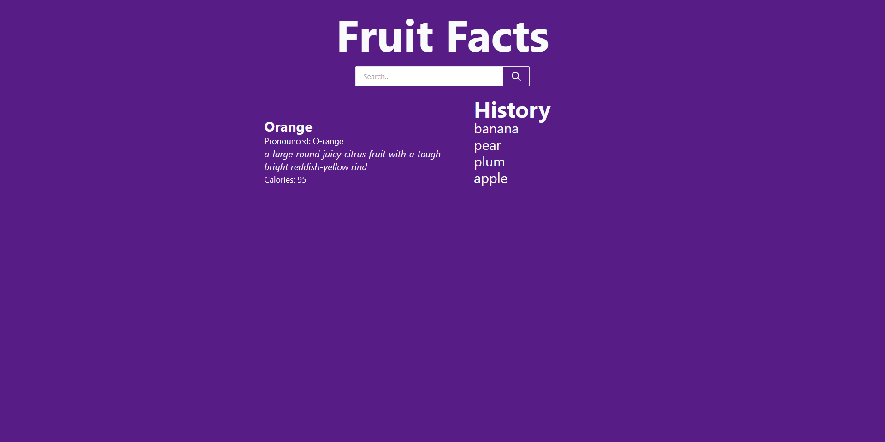

<h1>Project 7: Fruity Facts! <h2>
 
 <h2>Site URL:</h2>
  https://dmevola.github.io/fruitfacts/
 
 <h2>Screenshot<h2>
 </img>
   
 <h2>Summary</h2>
   
  <ul>
    <li>Using Javascript, JQuery, JQuery UI, and Tailwind CSS created a site that provides facts about fruits</li>
    <li>Used two APIs to query data, FruityVice and Dictionary</li>
    <li>Dynamically generate fruit facts, including calories and definition.</li>
    <li>Pushed searched fruit to local storage and pulled data on page load.</li>
    <li>Dynamically created HTML buttons on our page for search history.</li>
    <li>Pulled data from local storage and displayed search history.</li>
   </ul>

  <h2>Developed by</h2>
  
   <ul>
    <li>Dan Evola</li>
    <li>Nick Bentivolio</li>
    <li>Zachary Levin</li>
  </ul>
